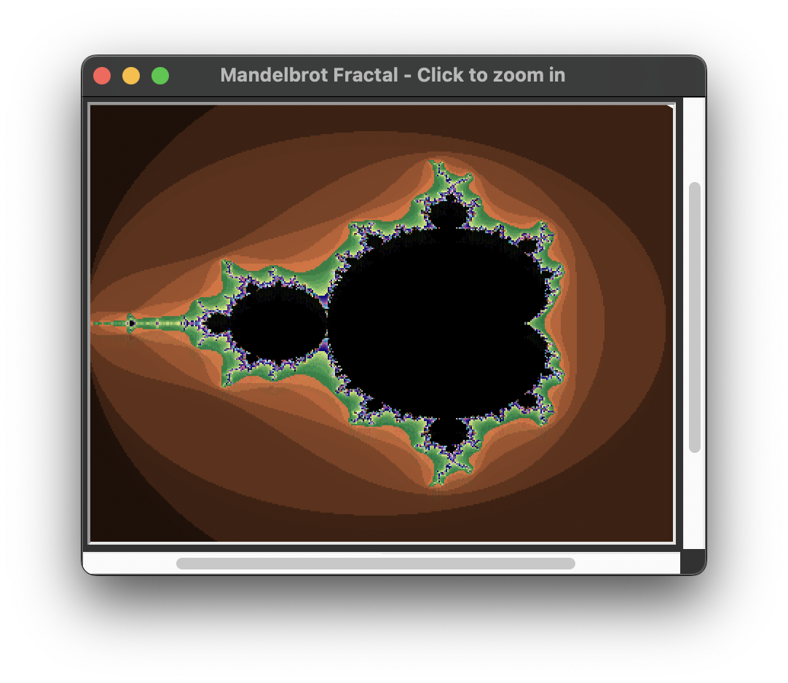
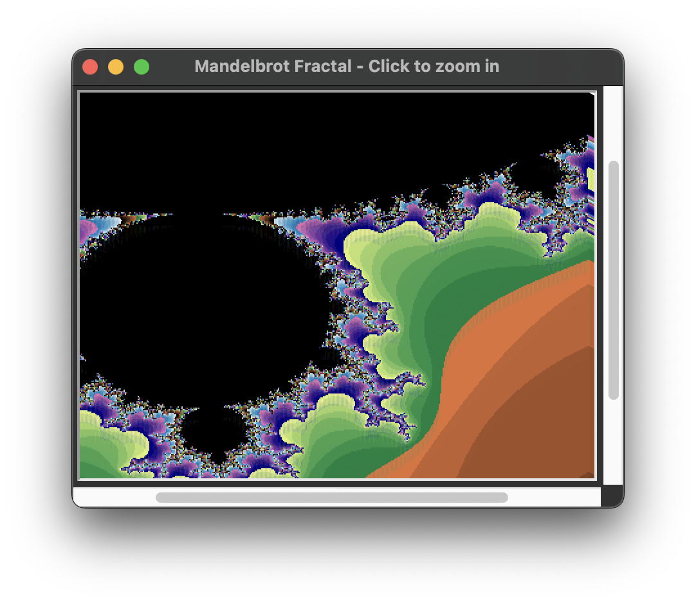
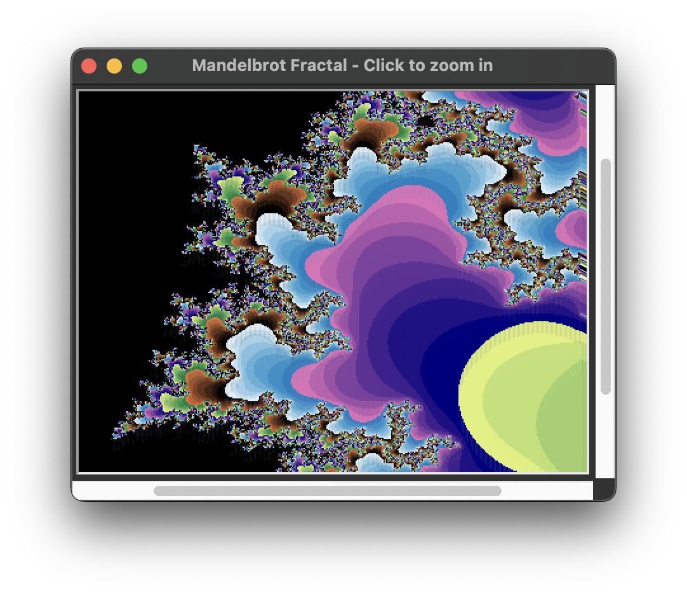
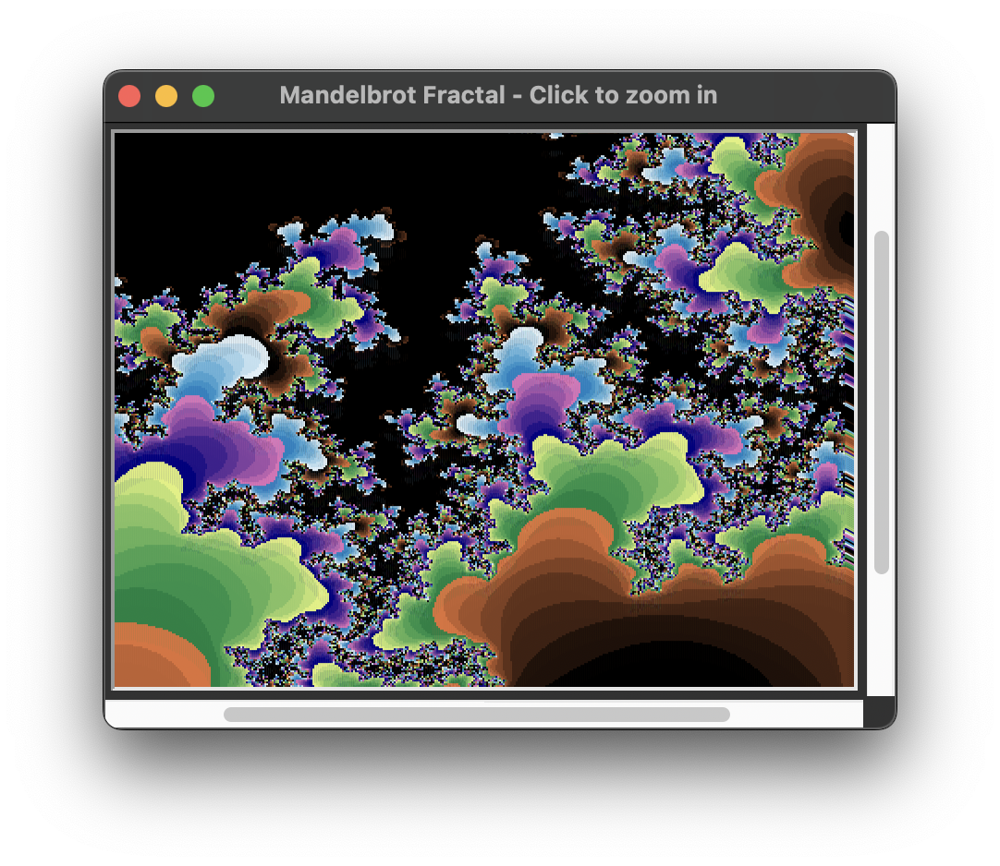
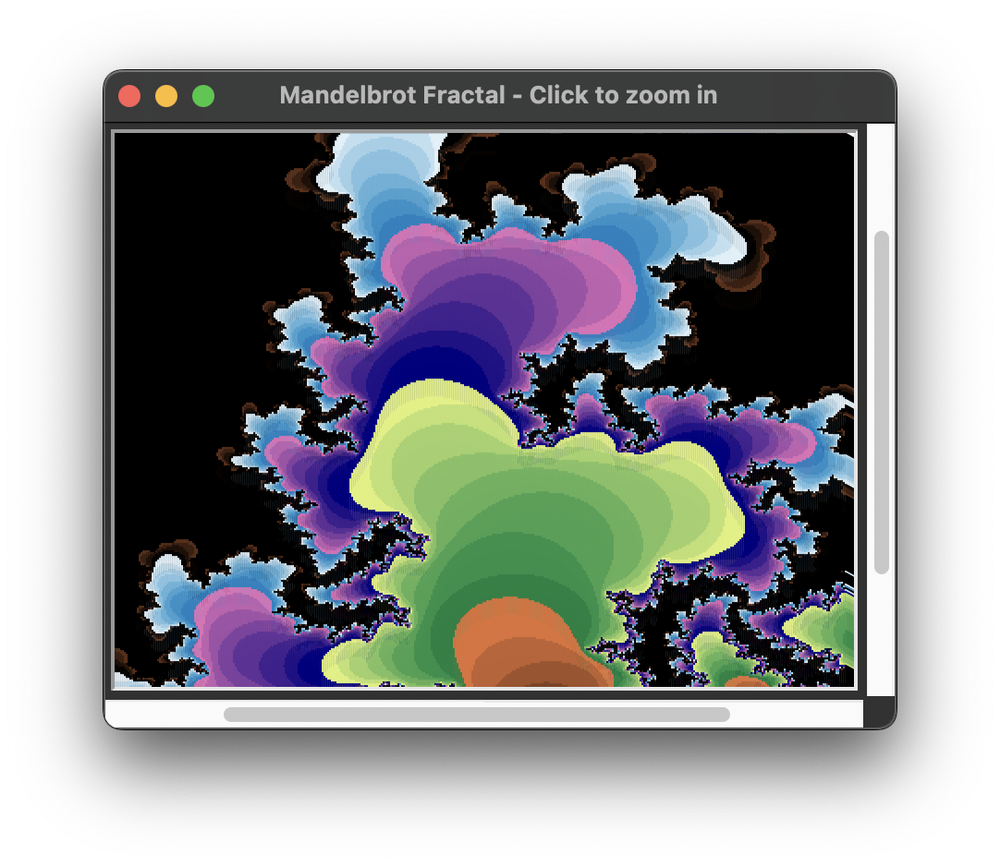

<h1 align="center" id="title">Mandelbrot Set Fractal</h1>

<p id="description">Colored Mandelbrot Set fractal.</p>

<h2>Project Screenshots:</h2>

<p align="center" width="100%">
     
</p>

<p align="center" width="100%">
     
     
</p>

<p align="center" width="100%">
     
     
</p>

   
<h2>🧐 Features</h2>

Here're some of the project's best features:

*   zoom in
*   progress of drawing
*   output the time it takes to draw


<h2>🛠️ Installation Steps:</h2>

<p>1. Clone the git repository</p>

```
git clone https://github.com/JuliaShst/Mandelbrot-Set
```

<p>2. Run script</p>

```
python mandelbrot-fractal-complete.py
```

  
